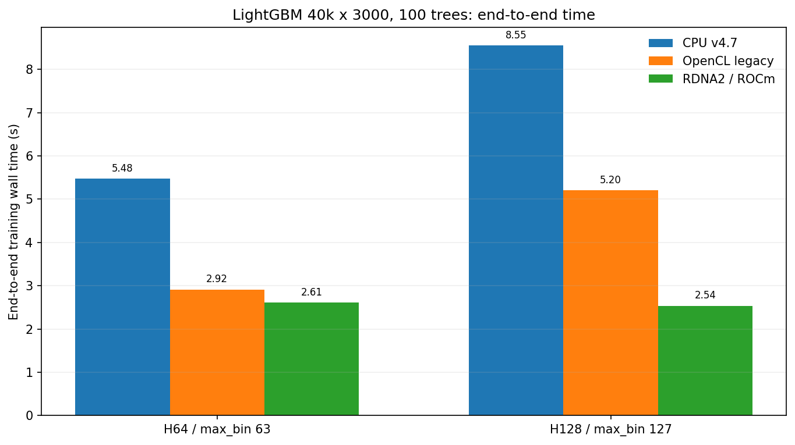
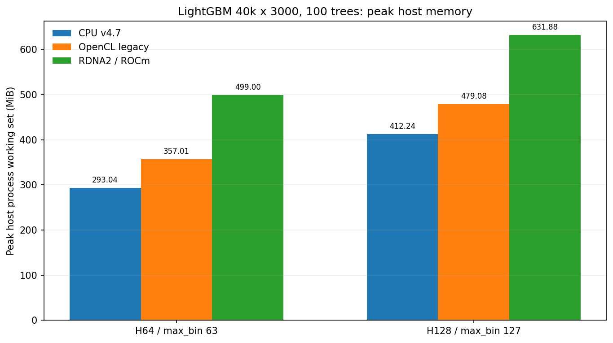

# LightGBM-RDNA2

Experimental LightGBM fork optimized for **native Windows ROCm/HIP training on AMD RDNA2**, with the current target being **Radeon RX 6800 XT / Navi21 / gfx1030** on Windows 11 and ROCm/HIP SDK 6.2.

The project is based on LightGBM 4.7.0 semantics and treats pristine upstream **LightGBM v4.7.0 CPU as the correctness oracle**. RDNA2-specific code is accepted only when it preserves canonical Dataset/binning rules, tree structure, and predictions within the strict benchmark contract.

> [!IMPORTANT]
> The current H64/H128 RDNA2 path passes the strict CPU-v4.7 correctness matrix for the production profiles covered by this repository, including binary classification, L2 regression, feature-fraction coverage, Optuna-shaped profiles, long-horizon runs, and quantile regression at `alpha=0.1/0.5/0.9`. This remains an experimental fork rather than an official LightGBM distribution.

## Headline results

Production benchmark shape: **40,000 training rows × 3,000 float32 features, 100 trees**, Ryzen 9 5950X + RX 6800 XT.

| Profile | Backend | End-to-end (s) | Speedup vs v4.7 CPU | Peak host WS (MiB) | Iteration (ms) |
|---|---|---:|---:|---:|---:|
| H64 / `max_bin=63` | pristine v4.7 CPU | 5.477 | 1.00x | 293.0 | 53.05 |
| H64 / `max_bin=63` | legacy OpenCL | 2.915 | 1.88x | 357.0 | **19.77** |
| H64 / `max_bin=63` | **RDNA2 / ROCm** | **2.611** | **2.10x** | 499.0 | 26.11 |
| H128 / `max_bin=127` | pristine v4.7 CPU | 8.551 | 1.00x | 412.2 | 83.77 |
| H128 / `max_bin=127` | legacy OpenCL | 5.202 | 1.64x | 479.1 | 42.73 |
| H128 / `max_bin=127` | **RDNA2 / ROCm** | **2.538** | **3.37x** | 631.9 | **25.38** |

RDNA2 is about **1.12x faster than legacy OpenCL end-to-end on H64** and about **2.05x faster on H128**, while preserving the pristine-v4.7 tree/prediction contract. H64 legacy OpenCL still has the lower pure boosting-iteration time in this specific profile, but RDNA2 wins the complete measured training process.





The memory chart above reports **peak host process working set** and does not include GPU VRAM. RDNA2 intentionally retains extra GPU-facing staging and learner state during full training, so complete-process host memory is higher than CPU/OpenCL. Dataset construction itself is much smaller than pristine CPU, which is the important pre-train result below.

## Dataset construction: from multi-second / multi-GiB to sub-second

The original production pipeline spent more wall time preparing LightGBM Datasets than training some Phase-1 models, while CPU utilization stayed low and transient memory grew dramatically. The dense row-major float32 path was therefore optimized as a first-class workload rather than treated as setup overhead.

Fresh-process, zero-copy contiguous-slice benchmark, **40k × 3000**, 32 CPU threads:

| Profile | Builder | DatasetCreate (s) | Peak delta above resident phase matrix (MiB) |
|---|---|---:|---:|
| H64 | pristine v4.7 CPU | 3.491 | 1543.5 |
| H64 | **current RDNA2 path** | **0.774** | **302.1** |
| H128 | pristine v4.7 CPU | 2.955 | 1543.5 |
| H128 | **current RDNA2 path** | **0.775** | **304.2** |

That is roughly **4.5x faster and 5.1x lower transient peak memory for H64**, and **3.8x faster / 5.1x lower transient peak for H128** in a fresh worker. In a long-lived process with the ROCm population context already warm, 40k × 3000 Dataset creation is commonly around **0.29–0.35 s**.

The current Python pipeline can still pay an additional approximately **457.8 MiB** for `features[train_idx]` when a TimeSeriesSplit training interval is represented through fancy indexing. The benchmark-proven equivalent contiguous slice is zero-copy and is the next pipeline-side optimization.

## What was optimized

### RDNA2 training path

The RDNA2 learner keeps LightGBM's canonical ownership boundaries and specializes physical execution for gfx1030:

- exact H64/H128 HIP histogram kernels using persistent canonical Feature4 packed input;
- aligned four-feature `uint32` packing once per Dataset/learner lifecycle instead of repacking every tree;
- persistent gfx1030 device representation with canonical bin IDs unchanged;
- direct/mapped canonical histogram output to Serial-owned host buffers, removing explicit histogram D2H staging on the accepted path;
- stream-scoped asynchronous gradient/Hessian/index preparation;
- preload of the next canonical smaller-leaf row-index range after Serial partitioning;
- elimination of unnecessary histogram memset when every active bin is overwritten by the producer kernel;
- tuple-local feature activity masks and fast all-active H64 SuperTile control flow;
- adaptive H64 eight-feature SuperTile for large leaves;
- compile-time direct-row versus indexed-row specialization;
- LDS structure-of-arrays layout and H128-specific bank-phase padding;
- H128 one-step input prefetch;
- H128 device-resident canonical histogram pool with parent-minus-smaller subtraction;
- batched H128 pair best-split work and event handoff;
- H128 GPU top-2 nomination only as a candidate reducer, with CPU `Dataset::FixHistogram` + canonical `FeatureHistogram::FindBestThreshold` retaining final split authority;
- pinned activity-mask staging and a read-only H128 nomination scheduling sidecar for supported full-feature shapes.

Several ideas were measured and rejected rather than kept just because they were more GPU-heavy: H64 finite top-K nomination, H128 top-1, larger H128 nomination counts, two-bank H128 layouts, direct in-place histogram/nomination fusion, feature-level CPU/GPU overlap, and other variants that either regressed wall time or broke long-horizon correctness.

### Dataset construction path

The dense C-row-major float32 builder received a separate optimization chain:

1. specialized single-matrix float32 construction removes per-row `std::vector<double>` materialization and the former all-feature nested sample-vector amplification;
2. canonical `BinMapper` construction is parallelized across features while preserving fold-local sampling/boundary ownership;
3. dense singleton EFB shortcuts are used only when canonical conflict rules prove bundling unnecessary; sparse/bundleable inputs keep the canonical fallback;
4. numerical float32 samples use a stable IEEE-key radix presort instead of widening the full sample to double and sorting doubles;
5. `FindBinFromSortedFloat32` builds canonical distinct double values/counts directly and delegates forced-bin handling, filtering, missing/default-bin rules, and sparse-rate decisions back to the shared BinMapper finalizer;
6. gather/radix workspaces are reused per OpenMP thread;
7. sixteen adjacent float32 numerical features are gathered in one row-major pass, matching one 64-byte cache line instead of repeatedly walking the matrix with an approximately 12 KB feature stride;
8. regular value-to-bin population is offloaded to RX 6800 XT only after CPU-authoritative BinMapper boundaries exist;
9. unsupported categorical/EFB/sparse/raw/wider-bin cases fall back to canonical CPU population;
10. raw input is streamed in bounded chunks and never needs to become one huge GPU-resident matrix;
11. pinned/device staging and boundary metadata persist across Datasets in one process;
12. first-process ROCm/staging initialization overlaps CPU BinMapper construction when possible;
13. the final population pipeline uses **two 4096-row slots**, overlapping host staging, H2D/kernel/D2H, and canonical DenseBin loading without increasing the total staging footprint relative to the former single 8192-row buffer.

On 40k × 3000, the accepted two-slot population stage is roughly **55–61 ms** versus about **72–80 ms** before pipelining, with only around **7–10 ms** observed GPU wait. A 500k × 4000 population microbenchmark also confirmed that bounded streaming avoids requiring the roughly 7.45 GiB raw float32 matrix to fit in VRAM at once.

## Correctness status

Pristine upstream **LightGBM v4.7.0 CPU, commit `8f7036f03627054d5a54a6f965b13f4b9ff2cb63`**, is the source of truth. The reference build comes from a separate checkout. Legacy OpenCL is treated as a performance/compatibility reference, not a universal exactness oracle.

Accepted production gates include:

- H64 and H128 binary classification;
- feature-fraction coverage across multiple fractions;
- bagging/subsampling and class weighting;
- representative Optuna profiles;
- long-horizon runs through the production tree-count envelope;
- `regression_l2`;
- `objective=quantile` with `alpha=0.1`, `0.5`, and `0.9`;
- byte-identical H64/H128 serialized Datasets against pristine v4.7;
- dedicated Dataset probes for zeros/NaNs, sparse/EFB fallback, categorical features, and reference-Dataset construction.

For the 40k × 3000 / 20-tree quantile matrix, all six H64/H128 alpha profiles pass. Prediction max difference is **0** in five cases and **8.88e-16** for H128 `alpha=0.9`; tree structure matches the CPU oracle in every case. The same six profiles also pass the full optimized raw-float32 Dataset → serialized Dataset → RDNA2 training end-to-end gate.

## Benchmark suites

The Windows benchmark harness lives under [`benchmarks/windows_rocm/`](benchmarks/windows_rocm/).

```powershell
# Fast representative correctness gate.
python .\benchmarks\windows_rocm\run_matrix.py --suite smoke

# Production H64 + H128, 100 trees, CPU/OpenCL/RDNA2.
python .\benchmarks\windows_rocm\run_matrix.py --suite production

# Quantile H64/H128 at alpha 0.1 / 0.5 / 0.9.
python .\benchmarks\windows_rocm\run_matrix.py --suite quantile

# Broader correctness coverage.
python .\benchmarks\windows_rocm\run_matrix.py --suite stress

# Feature-fraction and Optuna envelopes.
python .\benchmarks\windows_rocm\run_matrix.py --suite feature_fraction
python .\benchmarks\windows_rocm\run_matrix.py --suite optuna
python .\benchmarks\windows_rocm\run_matrix.py --suite optuna_long
python .\benchmarks\windows_rocm\run_matrix.py --suite optuna_compat
```

For Dataset-specific measurement and correctness:

```powershell
python .\benchmarks\windows_rocm\run_dataset_benchmarks.py --stage dataset_create --profile h64 --split-extraction both --candidate-dataset-device rdna2
python .\benchmarks\windows_rocm\run_dataset_benchmarks.py --stage end_to_end --profile h128 --iterations 100 --split-extraction contiguous_slice --candidate-dataset-device rdna2
```

Detailed profile definitions, benchmark methodology, exact measurement notes, and result reproduction live in [`benchmarks/windows_rocm/README.md`](benchmarks/windows_rocm/README.md).

The compact checked-in production snapshot used by the charts is [`benchmarks/windows_rocm/results/production_2026-08-12.json`](benchmarks/windows_rocm/results/production_2026-08-12.json). Charts can be regenerated with:

```powershell
python .\benchmarks\windows_rocm\plot_benchmark_results.py
```

## Target hardware and toolchain

- Windows 11
- AMD Ryzen 9 5950X
- AMD Radeon RX 6800 XT (`gfx1030`)
- AMD ROCm/HIP SDK 6.2
- Visual Studio 2022 / MSVC host environment
- AMD Clang for native HIP device compilation
- CMake + Ninja

The Windows ROCm setup is currently single-GPU. The fork intentionally targets this gfx1030 workload rather than trying to be a generic replacement for every LightGBM GPU backend.

## Source-only checkout and external build workspace

The repository checkout is intentionally source-only because it may live in a synchronized Google Drive directory. Generated CMake state, compiler outputs, binaries, benchmark datasets, models, predictions, and raw benchmark reports belong outside the repository.

Default external workspace:

```text
C:\Temp\LightGBM-RDNA2\
├── build\
│   ├── cpu\
│   └── rocm\
└── benches\
    ├── bin\
    ├── data\
    └── artifacts\
```

The wrapper builds into that external workspace by default:

```powershell
.\benchmarks\windows_rocm\build_and_benchmark.ps1 -Suite production
```

Use `-WorkRoot` to select another location. Standalone Python benchmark commands use `C:\Temp\LightGBM-RDNA2\benches` by default and can be redirected with `LIGHTGBM_RDNA2_TEMP`; binary lookup can be redirected with `LIGHTGBM_RDNA2_BIN`.

## Upstream

This project is a fork of the official [lightgbm-org/LightGBM](https://github.com/lightgbm-org/LightGBM) repository. Upstream LightGBM documentation, APIs, supported platforms, and general usage remain authoritative for functionality not explicitly changed here.

Expected remotes:

```text
origin   -> this LightGBM-RDNA2 fork
upstream -> https://github.com/lightgbm-org/LightGBM.git
```

## License

LightGBM-RDNA2 retains the upstream LightGBM MIT license. See [`LICENSE`](LICENSE).
